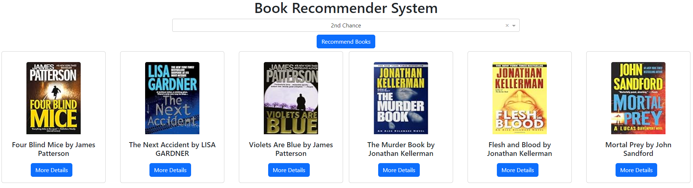

# Book Recommender System ([Live Application](https://huggingface.co/spaces/ashish-001/Book_recommender_system_))
The project is a web application that recommends books based on the user's current selection. It allows users to browse through an interactive interface, select a book, and receive personalized recommendations. The application displays detailed information about each recommended book, including its description, category, and a preview link. It incorporates collapsible panels for additional book details, maintains a layout with responsive design , and ensures an optimized user experience. 


## Steps to run the program on Windows
1. Create a virtual environment 
```
python -m venv "environment name"
```
2. Activate the virtual environment
```
"environment name"\Scripts\activate
```
3. Install all required libraries
```
pip install -r requirements.txt
```
5. Create a .env file
```
token='google_book_api_key'
```
4. Run the program
```
python app.py
```
## Image


